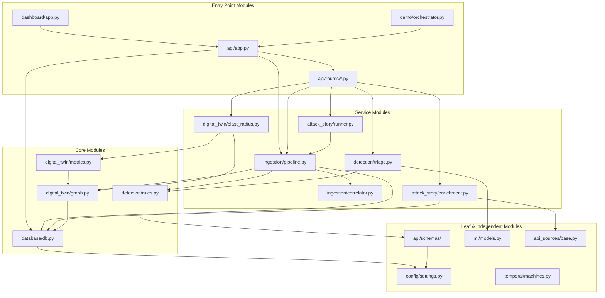

# Module Connectivity Analysis

## Dependency Map (DAG — no cycles)

## Module Categories

### Independent Modules (5)
- config/ (settings only)
- dashboard/templates/
- dashboard/static/
- scripts/
- docs/

### Leaf Modules (4)
- api/schemas/ (depends on config)
- ml/models.py (sklearn only)
- api_sources/base.py (httpx only)
- temporal/machines.py (no deps)

### Core Modules (4)
- database/db.py → config
- digital_twin/graph.py → database
- detection/rules.py → schemas
- digital_twin/metrics.py → graph

### Service Modules (6)
- ingestion/pipeline.py → 8 modules
- ingestion/correlator.py → 3 modules
- attack_story/runner.py → 5 modules
- attack_story/enrichment.py → 4 modules
- digital_twin/blast_radius.py → 3 modules
- detection/triage.py → 4 modules

### Entry Point Modules (22+)
- api/app.py → 10 modules
- api/routes/*.py → 3-8 each
- dashboard/app.py → 4 modules
- demo/orchestrator.py → 5 modules

## Statistics
| Metric | Value |
|--------|-------|
| Total Python modules | ~85 |
| Total internal imports | ~250 |
| Avg imports/module | 3.0 |
| Max imports (api/app.py) | 10 |
| Cyclic dependencies | 0 |

## Dependency Visualization

## Dependent vs Independent
- **Dependent modules:** ~35
- **Independent modules:** ~15
- **Leaf modules:** ~10
