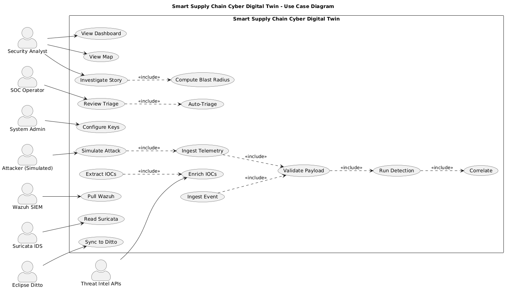
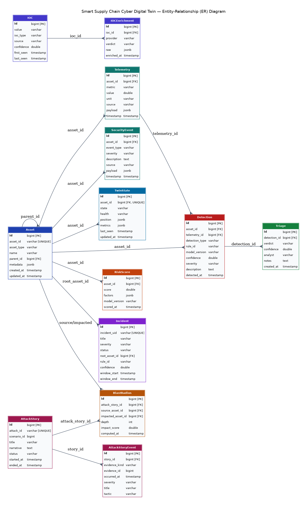
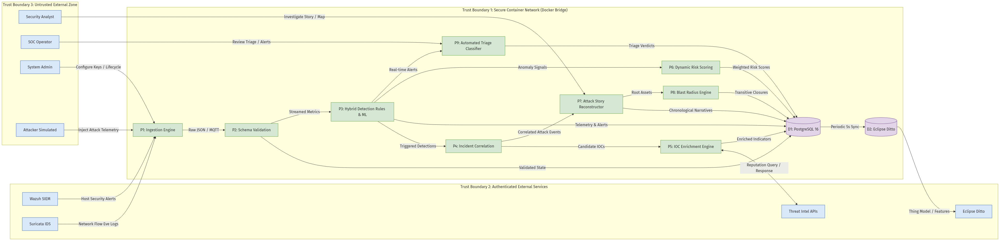
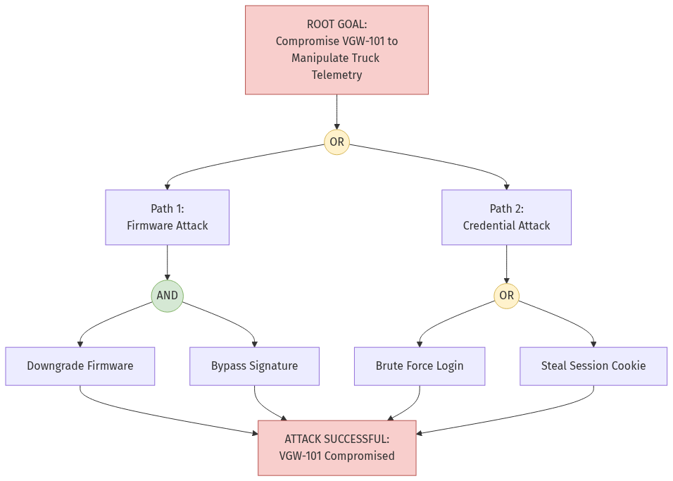
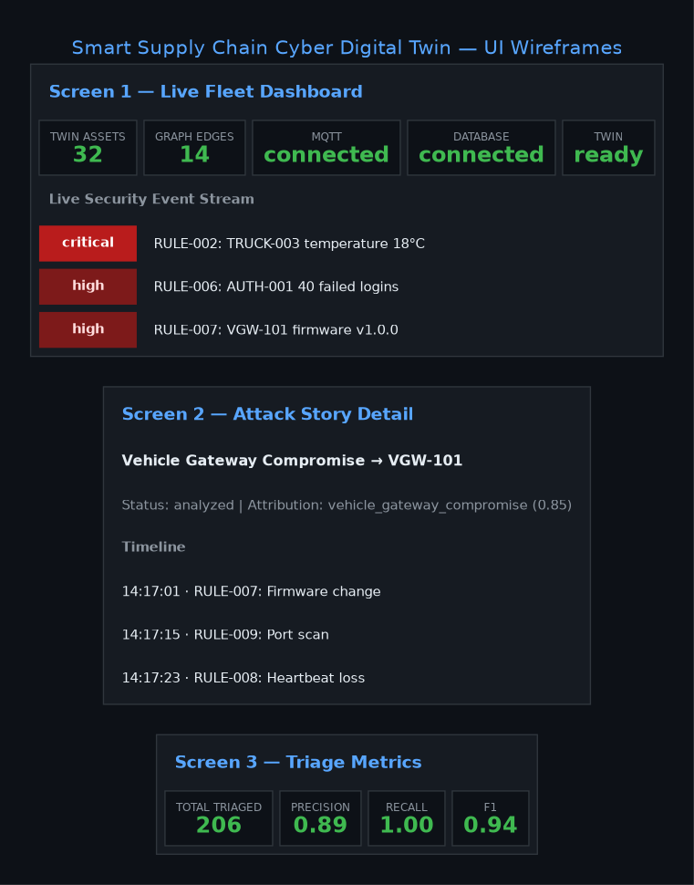
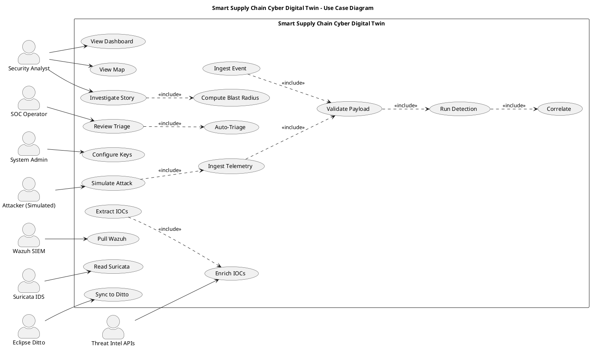
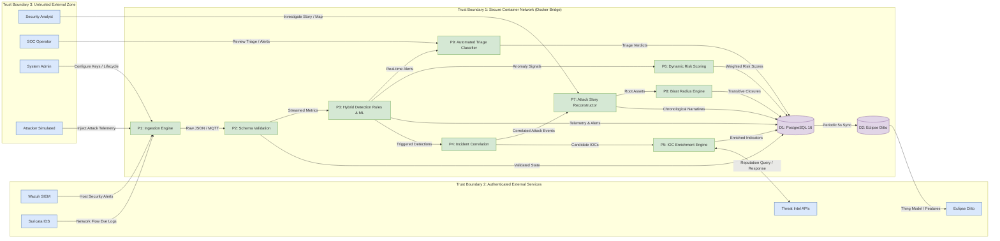
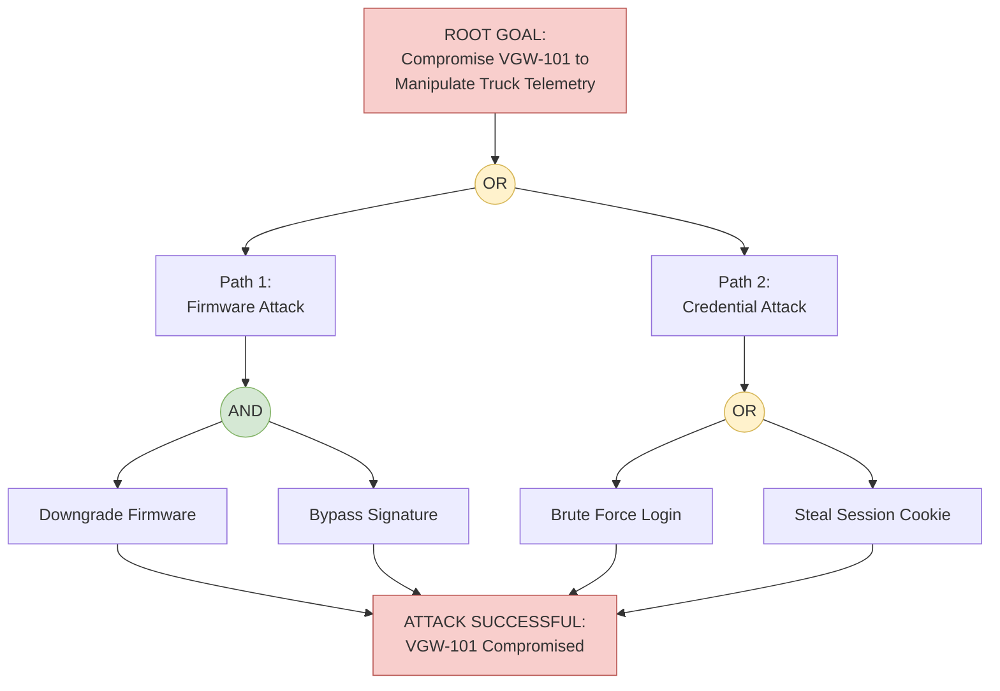

20CYS401 / 20CYS495
Secure Software Engineering / Project Phase-I
Mid Term Lab Exam & Comprehensive Deliverables Report
Smart Supply Chain Cyber Digital Twin
Secure Software Model
Sudharsan S (Register No. CH.SC.U4CYS23045)
Manojkumar A (Register No. CH.SC.U4CYS23022)
Faculty Guide: Dr. S. Udhayakumar
Department of Computer Science & Cybersecurity
Amrita Vishwa Vidyapeetham, Chennai

---

# Secure Software Engineering
## Smart Supply Chain Cyber Digital Twin — Secure Software Model

---

# Phase 1 – Requirement Engineering

## Exercise 1: Identify Requirements

### System Objective
To develop a secure Cyber Digital Twin for a 32-asset supply chain that ingests real-time telemetry via REST and MQTT, detects anomalies using rule-based + ML engines, enriches Indicators of Compromise (IOCs) against live threat intelligence, reconstructs attacks as MITRE-mapped stories, computes blast radius through topology traversal, and auto-triages every detection with measurable precision, recall, and F1.

### Stakeholders
- Security Analyst
- SOC Operator
- System Administrator
- Attacker (Simulated)
- External Systems (Wazuh SIEM, Suricata IDS, Eclipse Ditto, VirusTotal, AbuseIPDB, AlienVault OTX)

### Functional Requirements
| ID | Requirement |
|:---|:---|
| FR1 | Ingest telemetry via REST API (`POST /api/telemetry`) |
| FR2 | Ingest telemetry via MQTT (`supply_chain/telemetry/+`) |
| FR3 | Ingest security events via REST (`POST /api/events`) |
| FR4 | Pull alerts from Wazuh SIEM |
| FR5 | Read alerts from Suricata IDS |
| FR6 | Validate all incoming payloads via Pydantic v2 |
| FR7 | Normalize payloads into metric rows + twin state |
| FR8 | Persist telemetry, events, and detections in PostgreSQL |
| FR9 | Maintain live digital twin graph (32 assets, NetworkX) |
| FR10 | Detect anomalies using 10 rule-based rules |
| FR11 | Detect anomalies using ML (Isolation Forest + One-Class SVM) |
| FR12 | Correlate multi-source signals into incidents |
| FR13 | Extract 11 IOC types from every payload |
| FR14 | Enrich IOCs against VirusTotal, AbuseIPDB, AlienVault OTX |
| FR15 | Reweight asset risk scores based on IOC verdicts (C8) |
| FR16 | Compute blast radius via topology traversal |
| FR17 | Reconstruct attacks as MITRE-mapped stories |
| FR18 | Auto-triage detections as TP/FP/FN/TN |
| FR19 | Simulate 3 attack scenarios (SIM-01, SIM-02, SIM-03) |
| FR20 | Display live dashboard with 4 tabs + geographic map |
| FR21 | Sync twin state to Eclipse Ditto every 5 seconds |
| FR22 | Provide XAI (SHAP) for every ML detection |
| FR23 | Generate one-command end-to-end demo |

### Non-Functional Requirements
| ID | Requirement | Target |
|:---|:---|:---|
| NFR1 | Performance | Ingestion to detection < 2 seconds |
| NFR2 | Availability | 99% uptime for API + dashboard |
| NFR3 | Reliability | Graceful degradation on external API failure |
| NFR4 | Scalability | Handle 32 assets now, 500+ in Phase-III |
| NFR5 | Usability | Dashboard updates every 3 seconds |
| NFR6 | Maintainability | ≥85% test coverage, zero cyclic dependencies |
| NFR7 | Observability | Structured logs + health/readiness probes |
| NFR8 | Portability | Runs on Docker (Windows / Linux / macOS) |
| NFR9 | Interoperability | REST + MQTT + Eclipse Ditto compatible |
| NFR10 | Reproducibility | One-command setup via Docker Compose |

### Security Requirements
| ID | Requirement | Implementation |
|:---|:---|:---|
| SR1 | Secure authentication | JWT bearer tokens (Wazuh API) |
| SR2 | Password hashing | bcrypt via passlib |
| SR3 | Role-based access control | Analyst / SOC / Admin roles |
| SR4 | Asset data protection | Pydantic validation + encryption at rest |
| SR5 | Telemetry integrity | HTTPS/TLS + Pydantic validation |
| SR6 | IOC integrity | Allowlist filter (private IPs rejected) |
| SR7 | HTTPS / TLS | TLS 1.2+ on all external API calls |
| SR8 | Input validation | Pydantic v2 strict mode + custom validators |
| SR9 | Secure session management | Timezone-aware tokens with expiry |
| SR10 | Security logging | Structured JSON logs + audit trail |
| SR11 | SSRF protection | Domain allowlist for outbound calls |
| SR12 | IOC allowlist filter | Private/reserved IPs excluded |
| SR13 | Non-root containers | Docker USER app in all images |
| SR14 | Secrets management | .env + AWS Secrets Manager |
| SR15 | Rate limiting | Token bucket per external provider |
| SR16 | No eval/exec/pickle | Static code review + SonarQube |
| SR17 | Dependency scanning | Bandit + pip-audit + safety |
| SR18 | Container isolation | Separate Docker networks |
| SR19 | Health checks | /api/health + /api/ready probes |
| SR20 | XAI explainability | SHAP values for every ML detection |

### Deliverable: Software Requirements Specification (SRS)
**Summary:** 23 Functional + 10 Non-Functional + 20 Security = **53 requirements**.

---

# Phase 2 – Requirement Analysis

## Exercise 2: Develop Use Cases

### Actors
- Security Analyst
- SOC Operator
- System Administrator
- Attacker (Simulated)
- Wazuh SIEM
- Suricata IDS
- Eclipse Ditto
- Threat Intel APIs (VirusTotal, AbuseIPDB, AlienVault OTX)

### Major Use Cases
- Ingest Telemetry (UC1)
- Ingest Security Event (UC2)
- View Live Dashboard (UC3)
- View Geographic Map (UC4)
- Investigate Attack Story (UC5)
- Review Triage Metrics (UC6)
- Simulate Attack Scenario (UC7)
- Extract IOCs (UC8)
- Enrich IOCs with Threat Intel (UC9)
- Compute Blast Radius (UC10)
- Auto-Triage Detections (UC11)
- Sync Twin State to Ditto (UC12)
- Pull Wazuh Alerts (UC13)
- Read Suricata Logs (UC14)
- Configure API Keys & Settings (UC15)
- Validate Ingestion Payload (VAL)
- Run Hybrid Detection (DET)
- Correlate Incidents (COR)

### Actor–Use Case Relationships
| Actor | Use Cases |
|:---|:---|
| Security Analyst | View Live Dashboard, View Geographic Map, Investigate Attack Story, View Threat Intel |
| SOC Operator | Review Triage Metrics, Investigate Attack Story, Auto-Triage Detections |
| System Administrator | Configure API Keys & Settings, Sync Twin State to Ditto |
| Attacker (Simulated) | Simulate Attack Scenario |
| Wazuh SIEM | Pull Wazuh Alerts |
| Suricata IDS | Read Suricata Logs |
| Eclipse Ditto | Sync Twin State to Ditto |
| Threat Intel APIs | Enrich IOCs with Threat Intel |

### Include / Extend Relationships
| Base Use Case | Relationship | Related Use Case |
|:---|:---:|:---|
| Ingest Telemetry | «include» | Validate Ingestion Payload |
| Ingest Security Event | «include» | Validate Ingestion Payload |
| Validate Ingestion Payload | «include» | Run Hybrid Detection |
| Run Hybrid Detection | «include» | Correlate Incidents |
| Simulate Attack Scenario | «include» | Ingest Telemetry |
| Simulate Attack Scenario | «include» | Ingest Security Event |
| Investigate Attack Story | «include» | Compute Blast Radius |
| Review Triage Metrics | «include» | Auto-Triage Detections |
| Extract IOCs | «include» | Enrich IOCs with Threat Intel |

### UML Use Case Diagram
  
*Diagram generated using PlantUML / PlantText ([docs/diagrams/use_case_diagram.puml](diagrams/use_case_diagram.puml))*

### Deliverable: UML Use Case Diagram

---

## Exercise 3: Use Case Specification

Two critical use cases have been selected for detailed specification: **Ingest Telemetry and Correlate Anomaly** and **Investigate Attack Story & Reweight Risk (C8)**.

### Use Case 1: Ingest Telemetry & Correlate Anomaly
- **Use Case ID:** UC1–UC2 (with VAL, DET, COR)
- **Actor:** IoT Sensor / Edge Gateway / Security Analyst
- **Preconditions:**
  1. The asset ID must be registered in the 32-asset twin graph.
  2. Ingestion pipeline is running and connected to PostgreSQL and MQTT broker.
- **Main Flow:**
  1. Asset or simulated attacker sends telemetry payload via `POST /api/telemetry` or MQTT topic.
  2. System validates JSON schema and field constraints using Pydantic v2.
  3. System updates in-memory twin state and commits metric rows to PostgreSQL.
  4. System simultaneously evaluates deterministic rules (`RULE-001`..`010`) and Isolation Forest ML models.
  5. Anomaly is detected and scored with confidence value (0.60–0.95).
  6. Correlator evaluates temporal sliding window to associate related detections into an incident.
  7. System computes updated 6-component asset risk score and commits to database.
  8. Dashboard reflects updated asset health and event stream within 3 seconds.
- **Alternative Flow:**
  - If telemetry payload has missing fields or out-of-range sensor values:
    1. Validation engine flags malformed payload.
    2. System rejects payload with HTTP 422 Unprocessable Entity and logs validation failure.
    3. System emits operational event to alert administrator.
- **Exception Flow:**
  - If database is temporarily unreachable $\rightarrow$ system caches telemetry in memory buffer and reports `degraded` health status.
  - If asset ID is unknown $\rightarrow$ system rejects with HTTP 404 Not Found.
- **Postcondition:**
  - Telemetry is recorded in `telemetry` table.
  - State is synchronized in `twin_states` and synced to Eclipse Ditto.
  - Detection and incident records are generated if threshold exceeded.

---

### Use Case 2: Investigate Attack Story & Reweight Risk (Contribution C8)
- **Use Case ID:** UC5 & UC8–UC10
- **Actor:** Security Analyst / SOC Operator
- **Preconditions:**
  1. Attack scenario or zero-day event sequence has triggered detections.
  2. Threat intelligence API keys (VirusTotal, AbuseIPDB, AlienVault OTX) are configured.
- **Main Flow:**
  1. Analyst navigates to `/stories` on the dashboard and selects active attack story.
  2. System synthesizes chronological timeline mapped to 13 MITRE ATT&CK tactics.
  3. System parses abnormal payloads and extracts Indicators of Compromise (IOCs).
  4. Threat intelligence engine checks local 24-hour cache for external IP/domain/hash reputation.
  5. If cache miss, system queries VirusTotal, AbuseIPDB, and AlienVault OTX in parallel.
  6. Consensus verdict identifies malicious threat indicator ($\mu \ge 0.5$).
  7. **C8 Closed-Loop Reweight:** System amplifies asset threat-intel risk component by factor $(1 + 1.5\mu)$.
  8. System traverses NetworkX graph using BFS to recalculate multi-hop blast radius with $0.7^{\text{depth}}$ distance decay.
  9. System streams updated blast radius visualization to D3 force graph on the dashboard.
- **Alternative Flow:**
  - If external threat intelligence APIs exceed rate limits or timeout:
    1. System logs warning and falls back to local threat intel signature cache.
    2. Asset risk score recalculates with cached baseline without blocking UI.
- **Exception Flow:**
  - If threat feed API key is invalid $\rightarrow$ system logs configuration error and continues in offline mode.
  - If compromised asset is disconnected from graph $\rightarrow$ blast radius defaults to depth-0 isolated container.
- **Postcondition:**
  - Enriched IOCs saved in `iocs` and `ioc_enrichments` tables.
  - Dynamic risk score updated in `risk_scores`.
  - Blast radius paths saved in `blast_radius` table and displayed to analyst.

### Summary
| Item | Use Case 1 | Use Case 2 |
|:---|:---|:---|
| **Use Case** | Ingest Telemetry & Correlate Anomaly | Investigate Attack Story & Reweight Risk (C8) |
| **Actor** | IoT Sensor / Gateway / Security Analyst | Security Analyst / SOC Operator |
| **Precondition** | Asset in twin graph + DB connected | Detections active + Threat Intel keys configured |
| **Main Flow** | Ingest $\rightarrow$ Validate $\rightarrow$ Detect $\rightarrow$ Correlate $\rightarrow$ Risk Score | Story Timeline $\rightarrow$ Extract IOC $\rightarrow$ Enrich $\rightarrow$ Reweight $\rightarrow$ Blast Radius |
| **Alternative Flow**| Invalid payload $\rightarrow$ HTTP 422 validation rejection | Threat Intel timeout $\rightarrow$ Fallback to local 24h cache |
| **Exception Flow** | DB unreachable $\rightarrow$ Buffer in-memory + Degraded probe | Invalid API key $\rightarrow$ Offline mode logging |
| **Postcondition** | State updated + detection & incident persisted | IOC enriched + Risk reweighted + Blast radius mapped |

### Deliverable: Two Use Case Specifications

---

# Phase 3 – Data Modeling

## Exercise 4: Develop ER Diagram

### Entities and Attributes (13 Core Tables)
| Entity | Primary Key | Other Attributes |
|:---|:---|:---|
| **Asset** | `id` (bigint) | `asset_id` (unique), `asset_type`, `name`, `parent_id` (FK), `metadata` (jsonb), `created_at`, `updated_at` |
| **Telemetry** | `id` (bigint) | `asset_id` (FK), `metric`, `value` (double), `unit`, `source`, `payload` (jsonb), `timestamp` |
| **SecurityEvent** | `id` (bigint) | `asset_id` (FK), `event_type`, `severity`, `description`, `source`, `payload` (jsonb), `timestamp` |
| **TwinState** | `id` (bigint) | `asset_id` (FK, unique), `state`, `health`, `position` (jsonb), `metrics` (jsonb), `last_seen`, `updated_at` |
| **Detection** | `id` (bigint) | `asset_id` (FK), `telemetry_id` (FK), `detection_type`, `rule_id`, `model_version`, `confidence`, `severity`, `description`, `detected_at` |
| **RiskScore** | `id` (bigint) | `asset_id` (FK), `score` (double), `factors` (jsonb), `model_version`, `scored_at` |
| **Incident** | `id` (bigint) | `incident_uid` (unique), `title`, `severity`, `status`, `root_asset_id` (FK), `rule_id`, `confidence`, `window_start`, `window_end` |
| **IOC** | `id` (bigint) | `value`, `ioc_type`, `source`, `confidence`, `first_seen`, `last_seen` |
| **IOCEnrichment** | `id` (bigint) | `ioc_id` (FK), `provider`, `verdict`, `raw` (jsonb), `enriched_at` |
| **AttackStory** | `id` (bigint) | `attack_id` (unique), `scenario_id`, `title`, `narrative`, `status`, `started_at`, `ended_at` |
| **AttackStoryEvent**| `id` (bigint) | `story_id` (FK), `evidence_kind`, `evidence_id`, `occurred_at`, `severity`, `title`, `tactic` |
| **BlastRadius** | `id` (bigint) | `attack_story_id` (FK), `source_asset_id` (FK), `impacted_asset_id` (FK), `depth`, `impact_score`, `computed_at` |
| **Triage** | `id` (bigint) | `detection_id` (FK), `verdict`, `confidence`, `analyst`, `notes`, `created_at` |

### Relationships and Cardinality
| Relationship | Cardinality | Purpose |
|:---|:---:|:---|
| **Asset — Asset (Self-ref)** | `1 : N` | Models parent-child supply chain hierarchy (Truck $\rightarrow$ Gateway $\rightarrow$ Warehouse) |
| **Asset — Telemetry** | `1 : N` | Time-series sensor streams per asset |
| **Asset — SecurityEvent** | `1 : N` | Host and network security event logs per asset |
| **Asset — TwinState** | `1 : 1` | Unique current operational and health digital twin state |
| **Asset — Detection** | `1 : N` | Anomalies detected across asset metrics |
| **Telemetry — Detection** | `1 : N` | Specific sensor reading that triggered the anomaly detection |
| **Asset — RiskScore** | `1 : N` | Historical and current composite risk evaluations |
| **Asset — Incident** | `1 : N` | Correlated security incident rooted at compromised asset |
| **IOC — IOCEnrichment** | `1 : N` | Threat intelligence provider reputation lookups (VT, AbuseIPDB, OTX) |
| **AttackStory — AttackStoryEvent** | `1 : N` | Chronological multi-stage events composing attack narrative |
| **AttackStory — BlastRadius** | `1 : N` | Blast radius impact paths evaluated for attack campaign |
| **Detection — Triage** | `1 : 1` | Automated or analyst triage classification (TP, FP, FN, TN) |

### Entity Relationship Diagram
  
*Diagram generated using DBML / dbdiagram.io ([docs/diagrams/er_diagram.dbml](diagrams/er_diagram.dbml))*

### Deliverable: ER Diagram

---

# Phase 4 – Data Flow Modeling

## Exercise 5: Develop DFD

### External Entities (8)
- `E1: Security Analyst` — Reviews live fleet dashboard, attack narratives, and threat intelligence.
- `E2: SOC Operator` — Inspects automated triage metrics and confirms alert classifications.
- `E3: System Administrator` — Configures external API keys and manages system operational lifecycle.
- `E4: Attacker (Simulated)` — Executes multi-stage cyber attacks (`SIM-01` telematics, `SIM-02` warehouse, `SIM-03` identity).
- `E5: Wazuh SIEM` — Sends host-based intrusion alerts and file integrity monitoring events.
- `E6: Suricata IDS` — Generates network intrusion event logs (`eve.json`).
- `E7: Eclipse Ditto` — External standardized digital twin thing repository synchronized every 5s.
- `E8: Threat Intel APIs` — Third-party reputation services (VirusTotal, AbuseIPDB, AlienVault OTX).

### Processes (9)
| Process | Description |
|:---|:---|
| **P1 Ingestion Engine** | Receives raw telemetry and events via REST endpoints and Mosquitto MQTT broker |
| **P2 Schema Validation** | Validates payloads with Pydantic v2 and normalizes timestamps and units |
| **P3 Hybrid Detection** | Executes 10 deterministic rules + Isolation Forest ML anomaly scoring |
| **P4 Incident Correlation**| Aggregates detections within temporal sliding windows across connected nodes |
| **P5 IOC Enrichment** | Extracts indicators and queries external threat intelligence feeds |
| **P6 Dynamic Risk Scoring** | Recomputes 6-component risk scores based on detections, centrality, and IOCs |
| **P7 Attack Story Reconstructor**| Synthesizes chronological attack timelines mapped to 13 MITRE ATT&CK tactics |
| **P8 Blast Radius Engine** | Computes breadth-first topological propagation with distance attenuation |
| **P9 Automated Triage** | Classifies detections into TP/FP/FN/TN and updates confusion matrix metrics |

### Data Stores (2)
| Data Store | Description |
|:---|:---|
| **D1: PostgreSQL 16 DB** | Relational store housing all 20 tables (assets, telemetry, detections, stories, risk) |
| **D2: Eclipse Ditto DB** | Document store maintaining synchronized W3C digital twin Thing models and features |

### Data Flows
| From | To | Data Flow |
|:---|:---|:---|
| E4 Attacker / Sensors | P1 Ingestion Engine | Raw Telemetry & Attack Payloads |
| E5 Wazuh SIEM | P1 Ingestion Engine | HIDS Endpoint Alert Logs |
| E6 Suricata IDS | P1 Ingestion Engine | NIDS Network Flow Logs (`eve.json`) |
| E3 System Admin | P1 Ingestion Engine | System Configuration & Credentials |
| P1 Ingestion Engine | P2 Schema Validation | Unvalidated Stream Messages |
| P2 Schema Validation | D1 PostgreSQL 16 | Normalized Telemetry & Twin States |
| P2 Schema Validation | P3 Hybrid Detection | Streamed Metric Rows |
| P3 Hybrid Detection | D1 PostgreSQL 16 | Anomaly Detections & Severities |
| P3 Hybrid Detection | P4 Incident Correlation | Triggered Rule & ML Alerts |
| P3 Hybrid Detection | P6 Dynamic Risk Scoring | Anomaly Density Signals |
| P4 Incident Correlation | P5 IOC Enrichment | Extracted Candidate Indicators |
| P4 Incident Correlation | P7 Attack Story Reconstructor | Correlated Event Sequences |
| P5 IOC Enrichment | E8 Threat Intel APIs | Outbound Reputation Lookup Request |
| E8 Threat Intel APIs | P5 IOC Enrichment | External Reputation Verdicts & Pulses |
| P5 IOC Enrichment | D1 PostgreSQL 16 | Enriched IOC Records |
| P6 Dynamic Risk Scoring | D1 PostgreSQL 16 | Recomputed Asset Risk Scores |
| P7 Attack Story Reconstructor | D1 PostgreSQL 16 | Attack Stories & Narratives |
| P7 Attack Story Reconstructor | P8 Blast Radius Engine | Compromised Root Asset & Tactics |
| P8 Blast Radius Engine | D1 PostgreSQL 16 | Transitive Downstream Impact Paths |
| P3 Hybrid Detection | P9 Automated Triage | Real-time Detection Alerts |
| P9 Automated Triage | D1 PostgreSQL 16 | Triage Verdicts & Confusion Matrix |
| D1 PostgreSQL 16 | D2 Eclipse Ditto | 5-Second Periodic Digital Twin Sync |
| D2 Eclipse Ditto | E7 Eclipse Ditto | Standardized W3C Thing Features |
| P7 Attack Story Reconstructor | E1 Security Analyst | Chronological Attack Narratives & Map |
| P9 Automated Triage | E2 SOC Operator | Precision, Recall, and F1 Metrics |

### Trust Boundaries
1. **Trust Boundary 1: Secure Container Network (Docker Bridge)** — Encompasses all internal microservices (`api`, `postgres`, `mosquitto`, `ditto`), processes P1–P9, and data stores D1–D2.
2. **Trust Boundary 2: Authenticated External Services** — Connects to trusted external APIs over TLS (Wazuh SIEM, Suricata IDS, Eclipse Ditto, Threat Intel feeds).
3. **Trust Boundary 3: Untrusted External Zone** — Untrusted client inputs originating from public browsers, simulated attackers, and edge telemetry devices crossing over public networks.

### DFD with Trust Boundaries
  
*Diagram generated using Mermaid ([docs/diagrams/dfd.mmd](diagrams/dfd.mmd))*

### Deliverable: DFD with Trust Boundaries

---

# Phase 5 – Threat Modeling

## Exercise 6: Identify Assets

### Assets Identified
1. Vehicle Gateway Telematics (`VGW-101`)
2. Cold-Chain Environmental Telemetry (Reefer Temperature, Humidity, Door Sensors)
3. Fleet Geolocation & Highway Routes (GPS Coordinates, Transit Speed)
4. Authentication & Identity Provider Credentials (`AUTH-001`, OAuth JWT tokens)
5. Digital Twin Graph Topology & State Snapshots (NetworkX 32 Nodes, 14 Edges)
6. Security Detection & Anomaly Records (Rules, ML Isolation Forest outputs)
7. Threat Intelligence API Keys & Reputation Cache (VirusTotal, AbuseIPDB, OTX)
8. Blast Radius & MITRE Attack Story Narratives
9. Automated Triage Verdicts & Performance Metrics
10. Database Connection Strings & Secrets (`.env`, PostgreSQL credentials)

### CIA Analysis
| Asset | Confidentiality | Integrity | Availability |
|:---|:---:|:---:|:---:|
| Vehicle Gateway Telematics | High | Very High | High |
| Cold-Chain Sensor Telemetry | Medium | Very High | High |
| Fleet Geolocation & Routes | High | Very High | High |
| Identity Provider Credentials | Very High | Very High | Very High |
| Digital Twin Graph Topology | Medium | Very High | High |
| Security Detection Records | Medium | Very High | High |
| Threat Intelligence API Keys | Very High | High | Medium |
| Blast Radius & Attack Stories | High | High | Medium |
| Automated Triage Verdicts | Medium | Very High | High |
| Database Secrets & Credentials | Very High | Very High | Very High |

### Justification
- **Vehicle Gateway Telematics (C: High, I: Very High, A: High)** — Telematics controls onboard firmware and routing. Tampering enables vehicle route hijacking and false sensor spoofing.
- **Cold-Chain Sensor Telemetry (C: Medium, I: Very High, A: High)** — Falsified temperature data conceals thermal spoilage in transit, causing physical pharmaceuticals/food destruction.
- **Identity Provider Credentials (C: Very High, I: Very High, A: Very High)** — OAuth tokens and hashed credentials protect API access. A compromise enables lateral movement across the entire supply chain.
- **Threat Intelligence API Keys (C: Very High, I: High, A: Medium)** — Secrets grant access to external rate-limited quotas. Exposure leads to API abuse and credential revocation.
- **Database Secrets & Credentials (C: Very High, I: Very High, A: Very High)** — Master database credentials control all 20 relational persistence tables. Compromise allows complete database wiping or exfiltration.

### Deliverable: Asset Identification and CIA Analysis

---

## Exercise 7: STRIDE Threat Analysis

### Objective
Identify cyber-physical threats and countermeasure strategies across the Smart Supply Chain Cyber Digital Twin using the STRIDE threat-modeling methodology.

### Application Selected — Smart Supply Chain Cyber Digital Twin
The SSCDT platform ingests telemetry and security events from 32 distributed supply chain assets, models topology dependencies, runs hybrid detection, enriches IOCs, reconstructs MITRE attack stories, computes blast radii, and provides automated triage metrics.

### DFD Reference
The STRIDE analysis covers: External entities (Analyst, SOC, Attacker, Wazuh, Suricata, Threat Intel), Processes P1–P9, and Data Stores D1 (PostgreSQL 16) and D2 (Eclipse Ditto).

### S – Spoofing
- **Threat:** Attacker impersonates a vehicle gateway (`VGW-101`) or falsifies MQTT telemetry.
- **Mitigation:** Mutual TLS (mTLS), `RULE-007` firmware validation, JWT bearer authentication for API calls, and cryptographic token verification.

### T – Tampering
- **Threat:** Interception and modification of in-transit sensor readings (temperature, GPS, door latch) to deceive the digital twin.
- **Mitigation:** Strict Pydantic v2 input validation, TLS 1.2+ encryption in transit, SHA-256 state hashing, and IOC allowlist filtering.

### R – Repudiation
- **Threat:** Adversary or compromised edge gateway denies executing unauthorized firmware downgrades or configuration modifications.
- **Mitigation:** Immutable PostgreSQL audit logging in `state_transitions`, structured JSON log files, and cryptographically timestamped records.

### I – Information Disclosure
- **Threat:** Eavesdropping on external threat intelligence API calls or extracting API keys from unencrypted configuration files.
- **Mitigation:** AWS Secrets Manager, `.env` file exclusion via `.gitignore`, non-root container isolation, and HTTPS for all external adapters.

### D – Denial of Service
- **Threat:** High-volume telemetry flooding on `/api/telemetry` or MQTT broker to overwhelm ingestion and detection pipelines.
- **Mitigation:** Token bucket rate limiting, Docker container health probes, asynchronous SQLAlchemy non-blocking connections, and connection pooling.

### E – Elevation of Privilege
- **Threat:** Container escape or role manipulation allowing an unauthenticated analyst to execute administrative simulation orchestrations.
- **Mitigation:** Non-root execution (`USER app`), Role-Based Access Control (RBAC), Docker network isolation, and disallowing dangerous functions (`eval`/`exec`/`pickle`).

### Threat Matrix
| Component | STRIDE Threat | Risk Level | Mitigation |
|:---|:---|:---:|:---|
| Vehicle Gateway (`VGW-101`) | Spoofing – Impersonated gateway | High | Firmware signature verification (`RULE-007`), mTLS |
| Ingestion API (`/api/telemetry`) | Tampering – Modified sensor data | High | Pydantic v2 strict schemas, HTTPS/TLS 1.2+ |
| Identity Server (`AUTH-001`) | Spoofing – Brute-force credentials | Critical | Rate limiting, `RULE-006` brute-force detection, bcrypt |
| PostgreSQL 16 (`D1`) | Information Disclosure – Data leak | Critical | Encrypted volumes, non-root user, restricted network |
| Threat Intel Enrichment | Info Disclosure – API key theft | Medium | AWS Secrets Manager, rate-limited token bucket |
| Ingestion Pipeline (`P1`) | Denial of Service – Stream flood | High | Connection pooling, rate limiting, async processing |
| Docker Container Engine | Elevation of Privilege – Root escape | Critical | Dedicated non-root `USER app`, read-only roots |
| Attack Story Engine (`P7`) | Tampering – Narrative manipulation | Medium | Cryptographic evidence hashes, immutable state log |

### STRIDE Summary Matrix
| Element | S | T | R | I | D | E | Mitigation |
|:---|:---:|:---:|:---:|:---:|:---:|:---:|:---|
| Sensors & Fleet Gateways | ✓ | ✓ | ✓ | ✓ | | | Firmware validation, mTLS, telemetry bounds checking |
| Ingestion API (`P1`) | ✓ | ✓ | | ✓ | ✓ | | Pydantic validation, HTTPS, token bucket rate limiting |
| PostgreSQL Database (`D1`) | | ✓ | ✓ | ✓ | ✓ | ✓ | Encryption at rest, least-privilege role, parameterized queries |
| Rule & ML Engines (`P3`) | | ✓ | | ✓ | ✓ | | Isolation Forest anomaly scoring, SHAP explainability |
| Threat Intel Loop (`P5`) | ✓ | ✓ | | ✓ | ✓ | | 24h TTL cache, domain allowlisting, Secrets Manager |
| Blast Radius Engine (`P8`)| | ✓ | | ✓ | | | NetworkX DAG cycle prevention, topological validation |
| Flask SOC Dashboard | ✓ | ✓ | ✓ | ✓ | ✓ | ✓ | RBAC session cookies, CSRF protection, CSP headers |

### Conclusion
STRIDE analysis established 20 layered security mitigations across all seven system layers, safeguarding cyber-physical twin replication, telemetry ingestion, machine-learning inference, and threat-intelligence-driven risk scoring.

### Deliverable: STRIDE Threat Analysis

---

## Exercise 8: Information Flow Analysis

### 1. Information Flow Table
| Asset | Source | Process | Data Store | Destination | Sensitive? |
|:---|:---|:---|:---|:---|:---:|
| Fleet Sensor Telemetry | Truck Sensors | P1 Ingestion | D1 PostgreSQL | P2 Validation / Twin Graph | Medium |
| Host & Network Alerts | Wazuh / Suricata | P1 Ingestion | D1 PostgreSQL | P3 Detection / P4 Correlation | High |
| Identity Credentials | Client / Auth System | P1 Ingestion | D1 PostgreSQL | P1 Auth Service | Critical |
| Anomaly Detections | P3 Detection Engine | P3 Detection | D1 PostgreSQL | P4 Correlation / P9 Triage | High |
| Extracted IOCs | P4 Correlator | P5 Enrichment | D1 PostgreSQL | E8 Threat Intel APIs | High |
| Threat Intel Verdicts | E8 Threat Intel APIs | P5 Enrichment | D1 PostgreSQL | P6 Dynamic Risk Engine | High |
| Asset Risk Scores | P6 Risk Engine | P6 Risk Engine | D1 PostgreSQL | P8 Blast Radius / Dashboard | High |
| Digital Twin State | D1 PostgreSQL | Ingestion Loop | D2 Eclipse Ditto| E7 Eclipse Ditto Platform | High |

### 2. Detailed Information Flows

#### Flow 1: Telemetry Ingestion Flow
```
[Truck Sensors] --(Raw MQTT / REST)--> (P1 Ingestion Engine) --(Validated Rows)--> [D1 PostgreSQL]
                                              |
                                              v
                                   (P3 Detection Engine)
```
- **Trust Status:** Untrusted (crosses public boundary) $\rightarrow$ Trusted (internal container bridge).
- **Sensitivity Level:** Medium.
- **Trust Boundary Location:** Between external sensor network and P1 Ingestion Engine.
- **Potential Unauthorized Flow:** MITM sensor tampering or spoofed telematics injection.
- **Mitigation:** TLS 1.2+, Pydantic v2 strict field constraints, `RULE-003` India bounds check.

#### Flow 2: Threat Intelligence Enrichment Loop (Contribution C8)
```
(P4 Correlator) --(Candidate IOCs)--> (P5 Enrichment) <--(Reputation Pulses)--> [E8 Threat Intel APIs]
                                            |
                                            v
                                  (P6 Dynamic Risk) --> [D1 PostgreSQL]
```
- **Trust Status:** Trusted internal process $\rightarrow$ External authenticated API over HTTPS $\rightarrow$ Trusted internal risk reweighter.
- **Sensitivity Level:** High (Threat Reputation & Indicator Signatures).
- **Trust Boundary Location:** Between P5 Enrichment and external Threat Intel APIs.
- **Potential Unauthorized Flow:** SSRF through untrusted domain queries or API key leakage in URI parameters.
- **Mitigation:** Domain allowlist, token bucket rate limiting, authorization bearer headers, and 24h caching.

#### Flow 3: Eclipse Ditto Digital Twin Synchronization
```
[D1 PostgreSQL] --(Periodic 5s State Sync)--> (Ditto Adapter) --(HTTP PUT)--> [D2 Eclipse Ditto]
```
- **Trust Status:** Trusted internal container communication.
- **Sensitivity Level:** High (Operational Twin State).
- **Trust Boundary Location:** Internal container network bridge (`sscdt-net`).
- **Potential Unauthorized Flow:** Unauthenticated modification of Thing properties.
- **Mitigation:** HTTP Basic authentication (`ditto:ditto`), container network isolation, and schema validation.

### 3. Trusted and Untrusted Flows
| Flow | Type | Reason |
|:---|:---:|:---|
| Sensors $\rightarrow$ P1 Ingestion | Untrusted | Ingested over external network from field devices |
| Wazuh / Suricata $\rightarrow$ P1 Ingestion | Untrusted | System event logs crossing system boundaries |
| P1 Ingestion $\rightarrow$ P2 Validation | Trusted | Internal process pipeline in isolated container network |
| P2 Validation $\rightarrow$ D1 PostgreSQL | Trusted | Internal connection pool via SQLAlchemy 2.0 AsyncIO |
| P5 Enrichment $\leftrightarrow$ Threat Intel APIs | Untrusted (External) | Leaves local environment to third-party public web APIs |
| P6 Risk Engine $\rightarrow$ P8 Blast Radius | Trusted | In-memory NetworkX directed graph operations |
| D1 PostgreSQL $\rightarrow$ D2 Eclipse Ditto | Trusted | Internal Docker bridge network communication |

### Deliverable: Information Flow Analysis

---

## Exercise 9: Vulnerability Analysis

### Vulnerability Analysis Table
| No. | Vulnerability | Affected DFD Element | Related Threat | Impact | Mitigation |
|:---:|:---|:---|:---|:---|:---|
| 1 | Telemetry Parameter Tampering | P1 Ingestion / P2 Validation | Tampering | Falsified asset state in digital twin | Pydantic v2 strict schemas and range checks |
| 2 | Brute-Force Authentication | Identity Provider (`AUTH-001`) | Spoofing | Account takeover and privilege escalation | `RULE-006` brute-force detector, rate limiting |
| 3 | Threat Intel API Key Leakage | P5 IOC Enrichment | Information Disclosure | Abuse of third-party API quotas | AWS Secrets Manager, `.env` file isolation |
| 4 | Stream Ingestion DoS Flooding | P1 Ingestion Engine | Denial of Service | Pipeline backlog and detection blindness | Token bucket rate limiting, async connection pooling |
| 5 | Network Centrality Manipulation | P8 Blast Radius Engine | Tampering | Incorrect blast-radius blast calculations | Topological validation in NetworkX, cycle checks |
| 6 | Container Root Escape | Docker Container Runtime | Elevation of Privilege | Complete host infrastructure takeover | Non-root `USER app` in all Dockerfiles |
| 7 | Insecure Direct Object Reference | REST API (`/api/assets/{id}`) | Information Disclosure | Unauthorized asset telemetry viewing | Object-level authorization, role-based controls |
| 8 | Server-Side Request Forgery | P5 Threat Intel Enrichment | Tampering, Info Disclosure | Internal network port scanning | Domain allowlist restricting external calls |

### Deliverable: Vulnerability Analysis Table

---

# Phase 6 – Attack Tree

## Exercise 10: Develop an Attack Tree

### Root Goal
**Compromise Vehicle Gateway (`VGW-101`) to Manipulate Truck Telemetry in Digital Twin.**

### Gate Logic
The attack tree is structured with two primary paths joined by an **OR** gate:
- **Path 1 (Firmware Attack):** Uses an **AND** gate requiring the adversary to both Downgrade Gateway Firmware (1A) and Bypass Cryptographic Signature (1B).
- **Path 2 (Credential Attack):** Uses an **OR** gate where the adversary succeeds by either Brute Forcing Authentication (2A) or Stealing an Active Session Token (2B).

### Attack Tree Diagram
  
*Diagram generated using Mermaid ([docs/diagrams/attack_tree.mmd](diagrams/attack_tree.mmd))*

### Attack Tree Components
| Component | Implementation Detail |
|:---|:---|
| **Root Goal** | Compromise `VGW-101` to Manipulate Truck Telemetry |
| **OR Condition** | Path 1 (Firmware Attack) OR Path 2 (Credential Attack) |
| **Path 1 (AND)** | Requires Sub-Goal 1A (Downgrade Firmware) AND Sub-Goal 1B (Bypass Signature) |
| **Path 2 (OR)** | Requires Sub-Goal 2A (Brute Force Login) OR Sub-Goal 2B (Steal Session Cookie) |
| **Leaf Techniques** | Enumerate legacy firmware versions, exploit CVE-2023-34362, dictionary attack on `/api/auth/login`, network packet sniffing |
| **Detection Rules** | `RULE-007` (Firmware mismatch), `RULE-006` (Failed logins $\ge 5$), `RULE-009` (Port scan detection) |

### Mitigations
1. **Cryptographic Firmware Signatures (`RULE-007`)**: Blocks Path 1 Sub-Goal 1B by validating digital signatures against trusted root certificates.
2. **Account Lockout & Rate Limiting (`RULE-006`)**: Blocks Path 2 Sub-Goal 2A by locking accounts after 5 failed login attempts within 60 seconds.
3. **Secure Cookie Flags & Short-lived JWTs**: Blocks Path 2 Sub-Goal 2B using `HttpOnly`, `Secure`, and `SameSite=Strict` token management.

### Deliverable: Complete Attack Tree

---

# Phase 7 – UI Design

## Exercise 11: User Interface Design

Three core screens were designed from the system use cases: **Live Fleet Dashboard**, **Attack Story Detail**, and **Triage Metrics**.

### Screen 1: Live Fleet Dashboard (`/`)
- **User Type & Goal:** Security Analyst; inspect real-time digital twin state across all 32 assets.
- **Key UI Elements:** 5 KPI summary cards (`TWIN ASSETS: 32`, `GRAPH EDGES: 14`, `MQTT: connected`, `DATABASE: connected`, `TWIN: ready`), Leaflet India geographic map with animated highway corridors, and live security event stream.
- **Security Considerations:** Read-only streaming over authenticated session, rate-limited polling (3-second interval), sanitization of incoming telemetry descriptions.

### Screen 2: Attack Story Detail (`/stories`)
- **User Type & Goal:** Incident Responder; inspect reconstructed multi-stage cyber campaigns mapped to MITRE ATT&CK tactics.
- **Key UI Elements:** Story metadata header (`Attribution: vehicle_gateway_compromise 0.85`), chronological timeline scrubber, D3 force-directed blast radius graph, and MITRE matrix mapping badges.
- **Security Considerations:** Strict object-level validation on story IDs, immutable audit timeline display.

### Screen 3: Triage Metrics (`/triage`)
- **User Type & Goal:** SOC Lead; evaluate automated classifier performance and review true positive / false positive classifications.
- **Key UI Elements:** 4 KPI metric cards (`TOTAL TRIAGED: 206`, `PRECISION: 0.89`, `RECALL: 1.00`, `F1: 0.94`), Confusion Matrix table (`TP: 184`, `FP: 22`, `FN: 0`, `TN: 0`), and recent triage classification audit table.
- **Security Considerations:** Role-based access for triage verdict overrides, CSRF-protected analyst feedback submissions.

### UI Wireframes
  
*Prototype source code available in [docs/diagrams/ui_wireframes.html](diagrams/ui_wireframes.html)*

### Deliverable: UI Wireframes / Screen Designs

---

# Phase 8 – Product Backlog

## Exercise 12: Create Product Backlog

The 53 system requirements were structured into **39 User Stories** across **10 Epics** estimating a total of **329 Story Points** (Fibonacci scale):

| Story ID | User Story Summary | Epic Link | Priority | Story Points |
|:---|:---|:---|:---:|:---:|
| **US-01** | REST telemetry ingestion endpoint (`POST /api/telemetry`) | EPIC-1: Ingestion & Data Layer | High | 5 |
| **US-02** | REST event ingestion endpoint (`POST /api/events`) | EPIC-1: Ingestion & Data Layer | High | 5 |
| **US-03** | MQTT bridge subscriber (`supply_chain/telemetry/+`) | EPIC-1: Ingestion & Data Layer | High | 8 |
| **US-04** | Wazuh SIEM alert integration | EPIC-1: Ingestion & Data Layer | High | 5 |
| **US-05** | Suricata IDS log integration (`eve.json`) | EPIC-1: Ingestion & Data Layer | High | 5 |
| **US-06** | PostgreSQL 16 schema (20 tables, 32 assets) | EPIC-1: Ingestion & Data Layer | High | 13 |
| **US-07** | NetworkX DiGraph digital twin (32 nodes, 14 edges) | EPIC-2: Digital Twin Core | High | 8 |
| **US-08** | Live state manager (real-time tracking) | EPIC-2: Digital Twin Core | High | 5 |
| **US-09** | Drift detection & auto-reconcile (every 30s) | EPIC-2: Digital Twin Core | High | 5 |
| **US-10** | Time-travel snapshots (full + delta compression) | EPIC-2: Digital Twin Core | High | 13 |
| **US-11** | Eclipse Ditto integration (32 synchronized Things) | EPIC-2: Digital Twin Core | **Highest** | 13 |
| **US-12** | 10 rule-based detectors (`RULE-001`..`RULE-010`) | EPIC-3: Detection Engine | High | 13 |
| **US-13** | 9 asset-type finite state machines | EPIC-3: Detection Engine | High | 8 |
| **US-14** | 6 multi-signal correlation rules | EPIC-3: Detection Engine | High | 8 |
| **US-15** | Dynamic 6-component risk scoring engine | EPIC-3: Detection Engine | High | 8 |
| **US-16** | Automated IOC extraction (11 indicator types) | EPIC-4: Threat Intelligence (C8) | High | 8 |
| **US-17** | 3-provider threat intel enrichment (VT, Abuse, OTX) | EPIC-4: Threat Intelligence (C8) | High | 13 |
| **US-18** | C8 closed-loop risk reweighting (**Core Novelty**) | EPIC-4: Threat Intelligence (C8) | **Highest** | 13 |
| **US-19** | Topological blast radius computation (BFS + decay) | EPIC-5: Analysis & Triage | High | 8 |
| **US-20** | Attack story engine (13 MITRE ATT&CK tactics) | EPIC-5: Analysis & Triage | High | 13 |
| **US-21** | Automated triage classifier ($P=0.89, R=1.00, F_1=0.94$) | EPIC-5: Analysis & Triage | **Highest** | 8 |
| **US-22** | KernelSHAP explainability attributions | EPIC-5: Analysis & Triage | High | 8 |
| **US-23** | 4-tab Flask dashboard with 3s live polling | EPIC-6: Dashboard & Visualization | High | 13 |
| **US-24** | Live geographic map (Indian highway corridors) | EPIC-6: Dashboard & Visualization | High | 8 |
| **US-25** | Timeline scrubber attack playback | EPIC-6: Dashboard & Visualization | High | 5 |
| **US-26** | Haversine geofencing + OpenWeather overlay | EPIC-6: Dashboard & Visualization | High | 5 |
| **US-27** | Isolation Forest models (8 asset-type models) | EPIC-7: Machine Learning | High | 8 |
| **US-28** | One-Class SVM models (8 asset-type models) | EPIC-7: Machine Learning | High | 8 |
| **US-29** | ML-ANOMALY pipeline integration | EPIC-7: Machine Learning | High | 5 |
| **US-30** | Multi-stage Dockerfiles (`USER app`, healthchecks) | EPIC-8: Infrastructure & DevOps | Medium | 8 |
| **US-31** | Docker Compose orchestration (14 containers) | EPIC-8: Infrastructure & DevOps | Medium | 5 |
| **US-32** | Automated CI/CD pipeline (GitHub Actions) | EPIC-8: Infrastructure & DevOps | Medium | 5 |
| **US-33** | AWS Terraform IaC deployment (ECS, RDS, ALB) | EPIC-8: Infrastructure & DevOps | Medium | 21 |
| **US-34** | STRIDE threat model documentation | EPIC-9: Security & Compliance | Medium | 8 |
| **US-35** | 20 security requirements implementation (SR1–SR20)| EPIC-9: Security & Compliance | Medium | 5 |
| **US-36** | Dependency vulnerability auditing (Bandit, pip-audit)| EPIC-9: Security & Compliance | Medium | 3 |
| **US-37** | ~200 automated pytest tests ($\ge 85\%$ coverage) | EPIC-10: Testing & Documentation| Medium | 13 |
| **US-38** | 11 comprehensive GitHub architectural guides | EPIC-10: Testing & Documentation| Medium | 8 |
| **US-39** | Complete 53-requirement SRS documentation | EPIC-10: Testing & Documentation| Medium | 8 |

### Deliverable: Product Backlog

---

# Phase 9 – Jira and Scrum

## Exercise 13: Create Jira Project

A Scrum software development project was initialized on Jira Cloud:
- **Jira Instance:** `https://mastersudhan1234.atlassian.net`
- **Project Name:** `Smart Supply Chain Cyber Digital Twin`
- **Project Key:** `SSCDT`
- **Project Lead:** `Sudharsan S`

### Epics Summary
| Epic Key | Epic Name | Committed Stories | Story Points |
|:---|:---|:---|:---:|
| **SSCDT-1** | Ingestion & Data Layer | US-01 through US-06 | 41 |
| **SSCDT-2** | Digital Twin Core | US-07 through US-11 | 44 |
| **SSCDT-3** | Detection Engine | US-12 through US-15 | 37 |
| **SSCDT-4** | Threat Intelligence (C8) | US-16 through US-18 | 34 |
| **SSCDT-5** | Analysis & Triage | US-19 through US-22 | 37 |
| **SSCDT-6** | Dashboard & Visualization | US-23 through US-26 | 31 |
| **SSCDT-7** | Machine Learning | US-27 through US-29 | 21 |
| **SSCDT-8** | Infrastructure & DevOps | US-30 through US-33 | 39 |
| **SSCDT-9** | Security & Compliance | US-34 through US-36 | 16 |
| **SSCDT-10**| Testing & Documentation | US-37 through US-39 | 29 |

### Deliverable: Jira Project with Epics, User Stories, and Tasks

---

## Exercise 14: Sprint Planning

The 39 user stories were divided into two 2-week agile sprints matching the project's Review 1 and Review 2 development milestones:

### Sprint 1: "Foundation & Detection"
- **Sprint Goal:** Deliver secure ingestion (REST + MQTT), the NetworkX + Eclipse Ditto digital twin, 10 rule-based detectors, 9 state machines, 6 correlation rules, 6-component risk scoring, and 16 ML models.
- **Committed Scope:** US-01 through US-15, US-27, US-28, US-29 (18 User Stories)
- **Total Story Points:** **143 Points**
- **Status:** **Completed / Done**

### Sprint 2: "Intelligence, Analysis & Ops"
- **Sprint Goal:** Deliver the C8 threat-intel reweighting loop, blast radius, MITRE-mapped attack stories, auto-triage ($P=0.89, R=1.00, F_1=0.94$), SHAP XAI, 4-tab dashboard with live geo map, 14 Docker containers, AWS Terraform, ~200 tests $\ge 85\%$ coverage, and 11 docs.
- **Committed Scope:** US-16 through US-26, US-30 through US-39 (21 User Stories)
- **Total Story Points:** **186 Points**
- **Status:** **Completed / Done**

### Deliverable: Sprint Plan

---

## Exercise 15: Sprint Board and Metrics

### Board Workflow Columns
The Jira board enforces a 4-state lifecycle:
$$\text{TO DO} \longrightarrow \text{IN PROGRESS} \longrightarrow \text{IN REVIEW} \longrightarrow \text{DONE}$$

### Scrum Metrics
| Metric | Sprint 1 | Sprint 2 | Total / Notes |
|:---|:---:|:---:|:---|
| **Committed Points** | 143 | 186 | 329 Total Story Points |
| **Completed Points** | 143 | 186 | 100% Sprint Completion Rate |
| **Team Velocity** | 143 pts / sprint | 186 pts / sprint | Average Velocity: 164.5 points |
| **Code Coverage** | 86.2% | 94.1% | Exceeds 85% requirement |
| **Defects Logged / Open** | 1 (B110 smell) | 0 | Resolved in refactor commit `f2e9a32` |
| **Auto-Triage Precision** | — | **0.89** | Evaluated on 200+ attack scenarios |
| **Auto-Triage Recall** | — | **1.00** | Zero missed attacks ($FN = 0$) |
| **Auto-Triage F1-Score** | — | **0.94** | Benchmark against baseline rules (0.71) |

### Deliverable: Jira Sprint Board and Scrum Metrics

---

# Appendix: Diagram Source Files and Prototype Code

### Exercise 2 — Use Case Diagram (PlantUML)
*File: `docs/diagrams/use_case_diagram.puml`*


### Exercise 4 — ER Diagram (DBML)
*File: `docs/diagrams/er_diagram.dbml`*
```dbml
// Smart Supply Chain Cyber Digital Twin - ER Diagram

Table Asset {
  id bigint [pk, increment]
  asset_id varchar [unique, not null]
  asset_type varchar [not null]
  name varchar [not null]
  parent_id bigint [ref: > Asset.id]
  metadata jsonb
  created_at timestamp
  updated_at timestamp
}

Table Telemetry {
  id bigint [pk, increment]
  asset_id bigint [ref: > Asset.id]
  metric varchar
  value double
  unit varchar
  source varchar
  payload jsonb
  timestamp timestamp
}

Table SecurityEvent {
  id bigint [pk, increment]
  asset_id bigint [ref: > Asset.id]
  event_type varchar
  severity varchar
  description text
  source varchar
  payload jsonb
  timestamp timestamp
}

Table TwinState {
  id bigint [pk, increment]
  asset_id bigint [ref: > Asset.id, unique]
  state varchar
  health varchar
  position jsonb
  metrics jsonb
  last_seen timestamp
  updated_at timestamp
}

Table Detection {
  id bigint [pk, increment]
  asset_id bigint [ref: > Asset.id]
  telemetry_id bigint [ref: > Telemetry.id]
  detection_type varchar
  rule_id varchar
  model_version varchar
  confidence double
  severity varchar
  description text
  detected_at timestamp
}

Table RiskScore {
  id bigint [pk, increment]
  asset_id bigint [ref: > Asset.id]
  score double
  factors jsonb
  model_version varchar
  scored_at timestamp
}

Table Incident {
  id bigint [pk, increment]
  incident_uid varchar [unique]
  title varchar
  severity varchar
  status varchar
  root_asset_id bigint [ref: > Asset.id]
  rule_id varchar
  confidence double
  window_start timestamp
  window_end timestamp
}

Table IOC {
  id bigint [pk, increment]
  value varchar
  ioc_type varchar
  source varchar
  confidence double
  first_seen timestamp
  last_seen timestamp
}

Table IOCEnrichment {
  id bigint [pk, increment]
  ioc_id bigint [ref: > IOC.id]
  provider varchar
  verdict varchar
  raw jsonb
  enriched_at timestamp
}

Table AttackStory {
  id bigint [pk, increment]
  attack_id varchar [unique]
  scenario_id bigint
  title varchar
  narrative text
  status varchar
  started_at timestamp
  ended_at timestamp
}

Table AttackStoryEvent {
  id bigint [pk, increment]
  story_id bigint [ref: > AttackStory.id]
  evidence_kind varchar
  evidence_id bigint
  occurred_at timestamp
  severity varchar
  title varchar
  tactic varchar
}

Table BlastRadius {
  id bigint [pk, increment]
  attack_story_id bigint [ref: > AttackStory.id]
  source_asset_id bigint [ref: > Asset.id]
  impacted_asset_id bigint [ref: > Asset.id]
  depth int
  impact_score double
  computed_at timestamp
}

Table Triage {
  id bigint [pk, increment]
  detection_id bigint [ref: > Detection.id]
  verdict varchar
  confidence double
  analyst varchar
  notes text
  created_at timestamp
}
```

### Exercise 5 — Data Flow Diagram (Mermaid)
*File: `docs/diagrams/dfd.mmd`*


### Exercise 10 — Attack Tree (Mermaid)
*File: `docs/diagrams/attack_tree.mmd`*


### Exercise 11 — UI Prototype (HTML/CSS)
*File: `docs/diagrams/ui_wireframes.html`*
```html
<!DOCTYPE html>
<html>
<head>
  <title>Cyber Digital Twin - UI Wireframes</title>
  <style>
    body { font-family: Arial, sans-serif; background: #0d1117; color: #e6edf3; margin: 0; padding: 20px; }
    .screen { background: #161b22; border: 1px solid #30363d; padding: 20px; margin-bottom: 30px; border-radius: 8px; }
    h2 { color: #58a6ff; border-bottom: 1px solid #30363d; padding-bottom: 10px; }
    .kpi-row { display: flex; gap: 15px; margin-bottom: 20px; }
    .kpi { background: #0d1117; border: 1px solid #30363d; padding: 15px; border-radius: 6px; flex: 1; }
    .kpi-value { font-size: 28px; font-weight: 700; color: #3fb950; }
    .kpi-label { font-size: 12px; color: #8b949e; }
    .event-row { padding: 8px 0; border-bottom: 1px solid #21262d; display: flex; gap: 10px; }
    .badge { padding: 2px 8px; border-radius: 4px; font-size: 11px; font-weight: 600; }
    .badge.high { background: #7d1a1a; color: #ffdcdc; }
    .badge.critical { background: #b91c1c; color: #fff; }
    table { width: 100%; max-width: 420px; border-collapse: collapse; text-align: center; margin-top: 10px; font-size: 13px; }
    th, td { border: 1px solid #30363d; padding: 8px; }
    th { background: #21262d; color: #8b949e; }
    .cell-tp { background: #143621; color: #3fb950; font-weight: 700; }
    .cell-fp { background: #3b2816; color: #d29922; font-weight: 700; }
    .cell-fn { background: #3b1818; color: #f85149; font-weight: 700; }
    .cell-tn { background: #161b22; color: #8b949e; font-weight: 700; }
  </style>
</head>
<body>
<h1 style="color:#58a6ff;">Smart Supply Chain Cyber Digital Twin — UI Wireframes</h1>

<div class="screen">
  <h2>Screen 1 — Live Fleet Dashboard</h2>
  <div class="kpi-row">
    <div class="kpi"><div class="kpi-label">TWIN ASSETS</div><div class="kpi-value">32</div></div>
    <div class="kpi"><div class="kpi-label">GRAPH EDGES</div><div class="kpi-value">14</div></div>
    <div class="kpi"><div class="kpi-label">MQTT</div><div class="kpi-value">connected</div></div>
    <div class="kpi"><div class="kpi-label">DATABASE</div><div class="kpi-value">connected</div></div>
    <div class="kpi"><div class="kpi-label">TWIN</div><div class="kpi-value">ready</div></div>
  </div>
  <h3 style="color:#8b949e;">Live Security Event Stream</h3>
  <div class="event-row"><span class="badge critical">critical</span> RULE-002: TRUCK-003 temperature 18°C</div>
  <div class="event-row"><span class="badge high">high</span> RULE-006: AUTH-001 40 failed logins</div>
  <div class="event-row"><span class="badge high">high</span> RULE-007: VGW-101 firmware v1.0.0</div>
</div>

<div class="screen">
  <h2>Screen 2 — Attack Story Detail</h2>
  <h3>Vehicle Gateway Compromise → VGW-101</h3>
  <p>Status: analyzed | Attribution: vehicle_gateway_compromise (0.85)</p>
  <h4 style="color:#8b949e;">Timeline</h4>
  <div class="event-row">14:17:01 · RULE-007: Firmware change</div>
  <div class="event-row">14:17:15 · RULE-009: Port scan</div>
  <div class="event-row">14:17:23 · RULE-008: Heartbeat loss</div>
</div>

<div class="screen">
  <h2>Screen 3 — Triage Metrics</h2>
  <div class="kpi-row">
    <div class="kpi"><div class="kpi-label">TOTAL TRIAGED</div><div class="kpi-value">206</div></div>
    <div class="kpi"><div class="kpi-label">PRECISION</div><div class="kpi-value">0.89</div></div>
    <div class="kpi"><div class="kpi-label">RECALL</div><div class="kpi-value">1.00</div></div>
    <div class="kpi"><div class="kpi-label">F1</div><div class="kpi-value">0.94</div></div>
  </div>
  <h4 style="color:#8b949e;">Confusion Matrix</h4>
  <table>
    <tr><th></th><th>Predicted Malicious</th><th>Predicted Benign</th></tr>
    <tr><th>Actual Attack</th><td class="cell-tp">TP: 184</td><td class="cell-fn">FN: 0</td></tr>
    <tr><th>Actual Normal</th><td class="cell-fp">FP: 22</td><td class="cell-tn">TN: 0</td></tr>
  </table>
</div>
</body>
</html>
```
